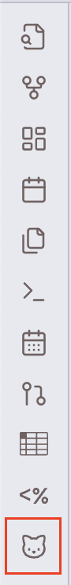
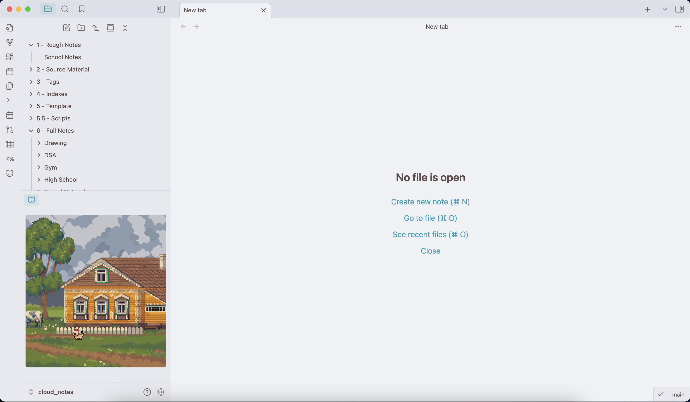
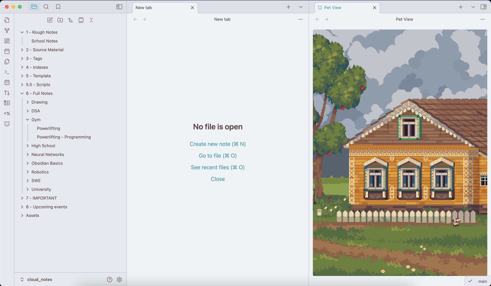
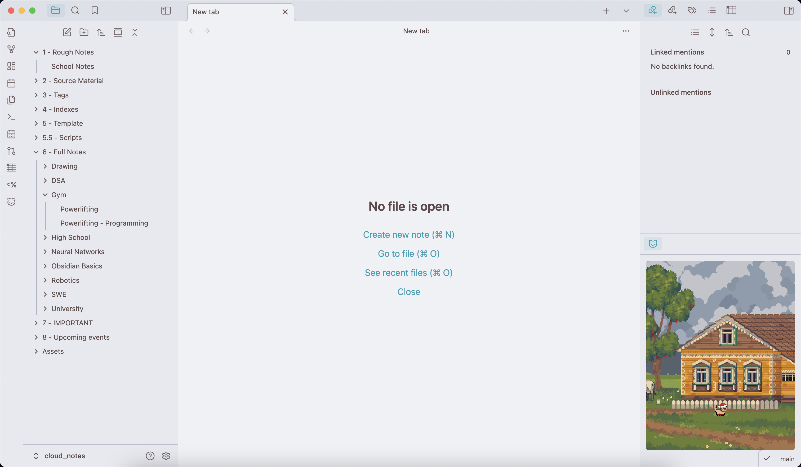

# Pixel Pets Plugin

A community plugin based off of the VSCode extension "[vscode-pets](https://marketplace.visualstudio.com/items?itemName=tonybaloney.vscode-pets)". It allows you to open a view in your vault where your various pixel pets can play.

## Key Features
- 🐱 22 different cats with 7+ different animations (and more pets on the way!)
    - Customizable with individual names (interactions coming soon...)
- 🖼️ 10 different backgrounds for your pets to play in
- ➡️ Movable view to allow for personal customization

## Getting Started
### Installation
#### Method 1: Community Plugins (Recommended)
1. In Obsidian, go to **Settings > Community Plugins**.
2. Click **Browse** and search for **"Pixel Pets"**.
3. Click **Install**, then **Enable** the plugin.

#### Method 2: Manual Installation
If the plugin isn't available in the community plugin list yet:
1. Download or clone this repository.
2. Copy the entire folder into your vault's `.obsidian/plugins/` directory.
3. In Obsidian, go to **Settings > Community Plugins** and click **Reload plugins**.
4. Enable **Pixel Pets** in the list of installed plugins.

### Adding Your First Pet
1. Enable the **Pixel Pets** plugin.
2. Once enabled, select the command `Add a pet`. Choose the pet's species and give it a name.
    - This will automatically open the pet view.
3. Select a background using the `Choose pet view background` command.
4. Continue to experiment with different backgrounds and pets, or just vibe along with your pets while you take notes, plan out RPGs, and more.

## UI Previews
Toggle the cat ribbon icon to open and close the view.

Here is a preview of what the plugin could look like (*Selected background: "Summer #1", added pet: "Christmas cat"*).

You can click and drag on the highlighted icon above the view to drag it into other views, as well as change the width and height of the view to customize your layout as desired. (See a couple of sample layouts below)

## Available Commands
- Adding pets
    - `Add a pet`: Select the species and provide it with a name. Added pets will immediately appear in the view.
- Removing pets
    - `Remove a specific pet`: Remove a specific pet. Provides a list of all the pets with their name and species.
    - `Remove all pets`: Removes all pets from the view.
- Background
    - `Choose pet view background`: Changes the background for the pet view. The background can also be changed in the settings tab.

## Contacts
If you have any kind of feedback or questions, feel free to reach out via GitHub issues or @hi.bye_2025 on the [Obsidian Discord server](https://discord.gg/obsidianmd).

## Credits
| Link| Description|
|--------------|---------------------------------|
|https://free-game-assets.itch.io/free-winter-nature-pixel-game-backgrounds| All winter backgrounds |
|https://ko-fi.com/s/8ffe7d812e| Snow animation for winter backgrounds |
|https://free-game-assets.itch.io/free-summer-pixel-art-backgrounds| All summer backgrounds |
|https://free-game-assets.itch.io/free-ancient-temple-pixel-game-backgrounds| All temple backgrounds |
|https://free-game-assets.itch.io/free-castle-interior-pixel-game-backgrounds| All castle backgrounds |
|https://toffeecraft.itch.io/cat-pixel-mega-pack| All cat sprites |